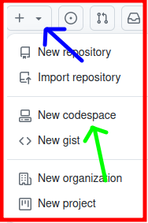
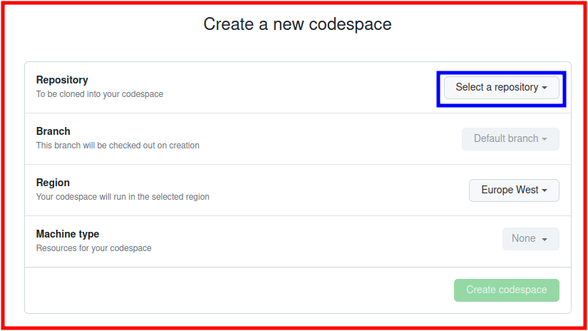
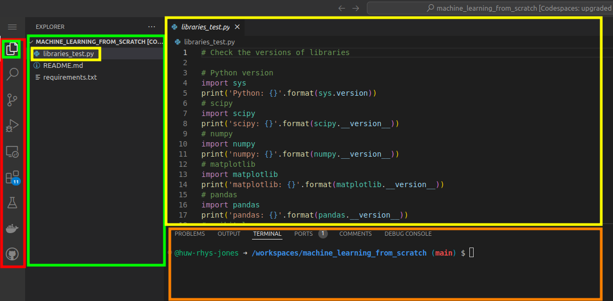

# Welcome to Machine Learning from Scratch!

## Intro

My name is Huw Rhys Jones and I completed a PhD in machine learning about a year ago. During my studies, I developed a deep understanding of the topic of practical machine learning, going right down to the very basics and all the way up to building complex neural networks.

Since learning the basics, I went on to develop novel methods in the field of machine learning and data science and had several journal articles published. In the year and a bit since, I have moved on in my career, but I have lost touch with the practical basics.

That's what this project is all about! If you want to learn how to make practical use of machine learning, this is the place to start!

## Source material

Whilst studying for my PhD, I kept finding myself on the same website over and over again: [Machine Learning Mastery](https://machinelearningmastery.com/). This website gives you a practical, hands-on guide to understanding and using machine learning techniques, from the very simple to cutting-edge methods.

## Motivation

So what's the point of this project? Can't you just follow the aforementioned website with its tutorials? Well yes, but I am hoping this project will provide a few advantages over directly using it:

1. It's a bit hard to know where to start on [Machine Learning Mastery](https://machinelearningmastery.com/). The tutorials there are excellent, but there's so many different topics and routes to take through. Here, I am going to try and provide a linear tutorial which blends the various areas of study.
2. I've copied a lot of the code into files within this repository. It'll save you a little bit of time.
3. The CodeSpace associated with this repository will provide a coding environment ready made.
4. I have updated a few things which appear out of date on the webiste.

Having said all that, I'll be linking directly to the website in every chapter of this project.

## Getting started

We're going to start by setting up our programming environment (the thing we use to write and run the code). We're going to do this with GitHub CodeSpace.

Head over to [GitHub](https://github.com/) and click the plus button in the top right hand corner and select *New Codespace*. On the next page, *Select a repository*. In the drop down menu, search for *huw-rhys-jones/machine_learning_from_scratch*.

You'll see some message pop up saying you are responsible for paying for this Codespace - don't worry, if you haven't entered your payment details into your GitHub, you can't be charged if you go over the free usuage. 

Everything else should be left as default. Then hit the green *Create codespace*. The Codespace should then open. Personally, the first thing I do is change the theme to a darker colourscheme (you can do this by clicking the cog in the bottom left corner). 

## The Codespace

Let's take a quick look at our open Codespace. On the left (red) is our navigation panel - try clicking a few of these buttons and you'll notice the panel next to it (green) will change. In the image above, you'll notice the the *Explorer* option is currently selected. This panel allows the user to select various files that are in this repository. Currently, the `libraries_test.py` file is open in the *editor* view (yellow). This panel is where we can write and edit the code which forms our project. Bellow the editor, we see the *terminal* - this is a very important part of the workspace. The *terminal* is how we instruct the computer behind the Codespace to execute commands like running code and other things.

## Ready to go

You're all set up and ready to start building machine learning models!

